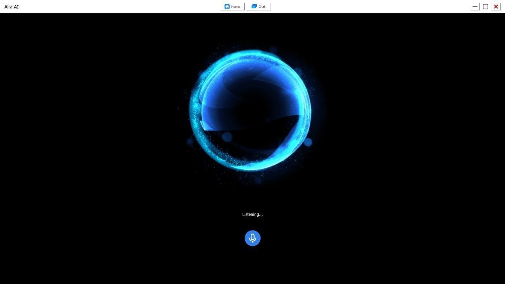
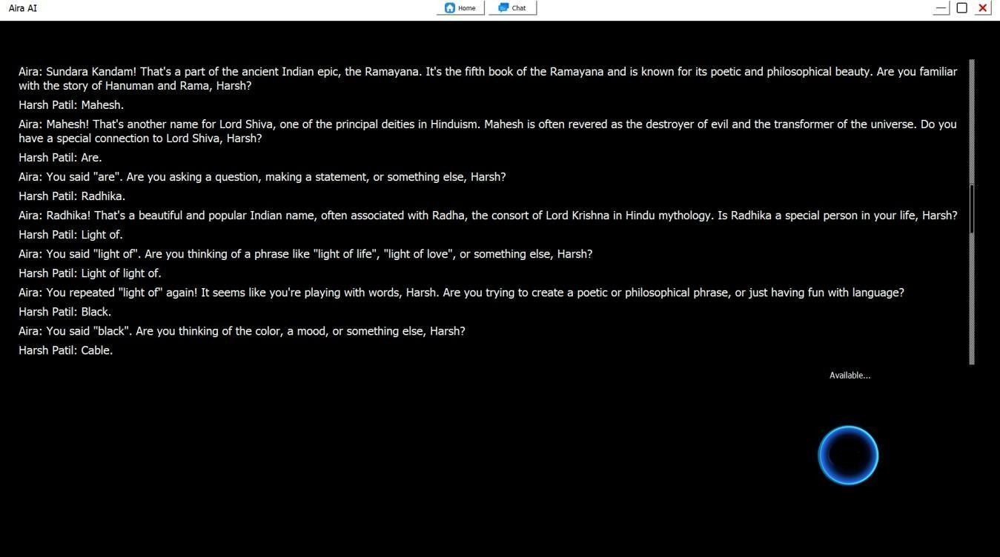
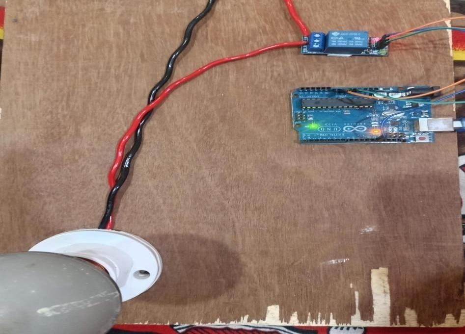
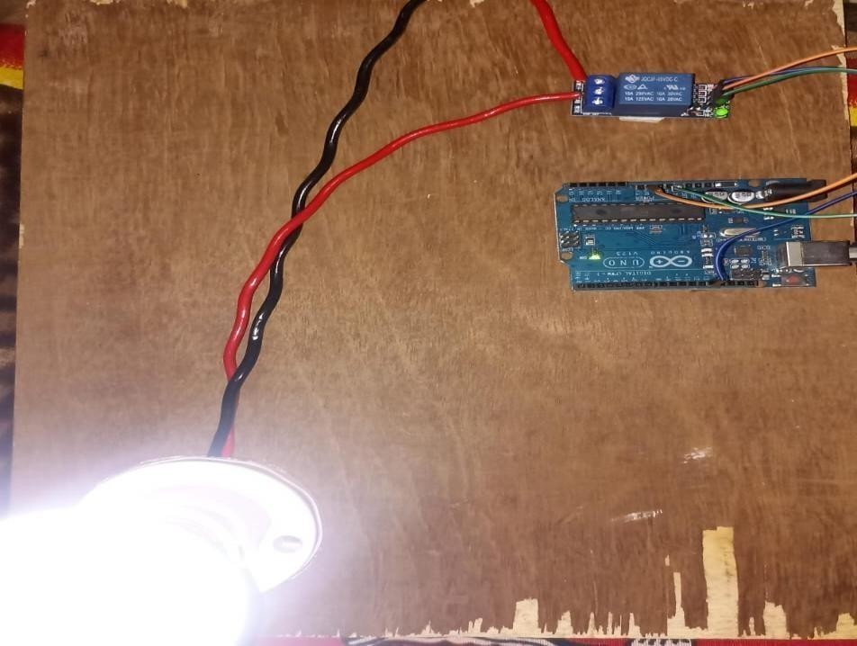

# 🤖 Aira - AI Desktop Assistant


---

## 📌 Overview

**Aira** is an AI-powered desktop assistant built using Python that performs real-time automation, executes voice commands, and integrates with Arduino for home automation.

It combines AI capabilities with system-level automation to provide an intelligent assistant experience similar to modern virtual assistants.

---

## 🚀 Features

* 🎙️ Voice Recognition & Command Execution
* 🤖 AI Chatbot Integration
* 🌐 Real-time Web Search
* 🖥️ Application Automation
* 💡 Home Automation using Arduino (Light Control)
* 🖼️ AI Image Generation
* 🔊 Text-to-Speech & Speech-to-Text

---

## 🛠️ Tech Stack

* **Language:** Python
* **GUI:** PyQt5
* **Libraries:** SpeechRecognition, pyttsx3, requests
* **Hardware:** Arduino + Relay Module
* **APIs:** Hugging Face / Web APIs

---

## 📂 Project Structure

```bash
AIRA/
├── Backend/
├── Frontend/
├── Data/
├── assets/
├── Main.py
├── light.py
├── requirements.txt
```

---

## ▶️ How to Run

### 1. Clone the repository

```bash
git clone https://github.com/Harshpdev-ux/aira-ai-assistant.git
cd aira-ai-assistant
```

### 2. Install dependencies

```bash
pip install -r requirements.txt
```

### 3. Run the project

```bash
python Main.py
```

---

## 🔐 Environment Variables

Create a `.env` file in the root directory and add:

```bash
API_KEY=your_api_key_here
```

---

## 📸 Screenshots

### 🖥️ AI Assistant UI



### 💬 AI Answering Mode



### 💡 Home Automation (OFF)



### 💡 Home Automation (ON)



---

## 🎯 Future Improvements

* Mobile app integration 📱
* Better UI/UX design 🎨
* Support for more smart devices 🏠
* Convert into standalone desktop application 💻

---

## 👨‍💻 Author

**Harshal Patil**
🔗 GitHub: https://github.com/Harshpdev-ux

---

## ⭐ Show Your Support

If you like this project:

* ⭐ Star the repository
* 🍴 Fork it
* 🛠️ Contribute

---
